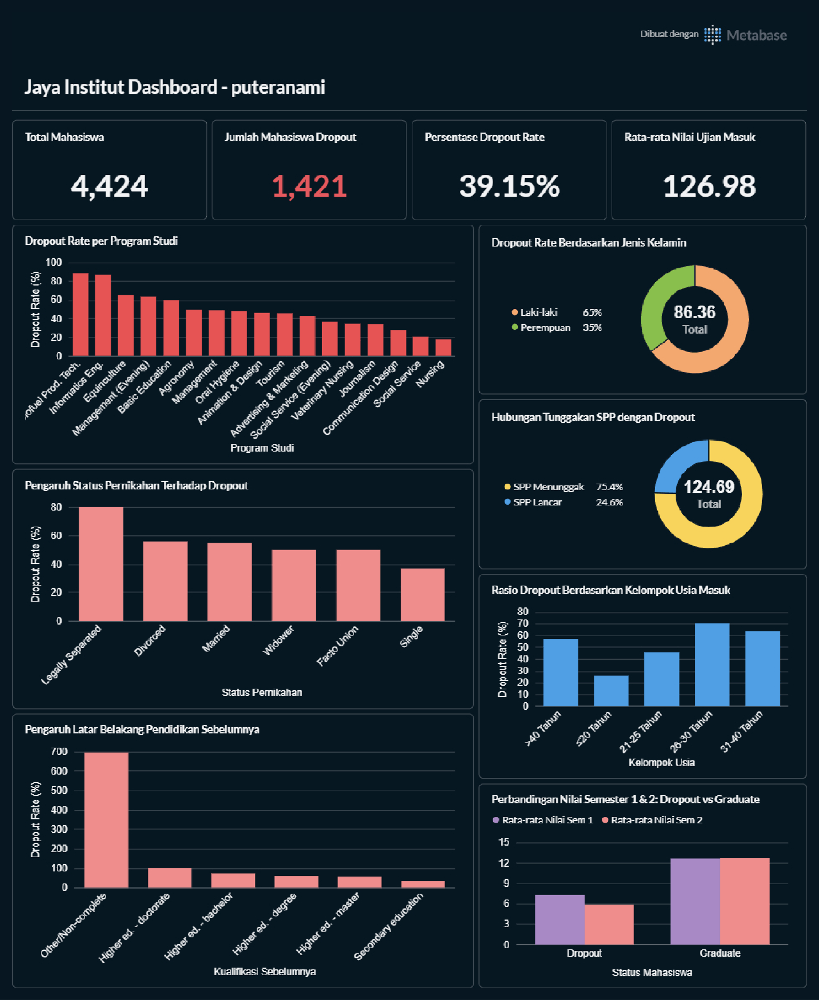

# Proyek Akhir: Prediksi Dropout Mahasiswa - Jaya Jaya Institut

## Business Understanding

Jaya Jaya Institut merupakan salah satu institusi pendidikan perguruan tinggi yang telah berdiri sejak tahun 2000. Hingga saat ini, institut ini telah mencetak banyak lulusan dengan reputasi yang sangat baik. Akan tetapi, terdapat tantangan yang signifikan berupa tingginya jumlah siswa yang tidak menyelesaikan pendidikannya alias dropout.

### Permasalahan Bisnis

Jumlah dropout yang tinggi mendatangkan kerugian besar untuk institusi pendidikan, baik dari sisi finansial maupun reputasi akademis:
1. **Kehilangan Pendapatan Jangka Panjang**: Setiap mahasiswa yang dropout berarti hilangnya potensi pendapatan SPP (*tuition fees*) untuk sisa semester masa studi mereka.
2. **Efisiensi Sumber Daya**: Proses pendaftaran, seleksi, dan alokasi fasilitas/dosen di awal semester menjadi kurang efisien karena kapasitas kelas berkurang di tengah jalan.
3. **Reputasi Institusi**: Tingginya angka dropout dapat menurunkan daya tarik institut di mata calon mahasiswa baru dan pemeringkatan akreditasi pendidikan.

Oleh karena itu, Jaya Jaya Institut membutuhkan sebuah **Early Warning System** (sistem peringatan dini) untuk mendeteksi secepat mungkin mahasiswa yang berisiko dropout sehingga pihak pembimbing akademik dan bimbingan konseling dapat memberikan bimbingan serta intervensi khusus secara proaktif.

### Cakupan Proyek

Untuk menyelesaikan permasalahan di atas, proyek ini mencakup:
1. **Analisis Data Eksploratif (EDA)**: Menelaah faktor-faktor pendorong dropout dari aspek demografi, pendaftaran, performa akademik, dan ekonomi makro.
2. **Preprocessing & Penanganan Class Imbalance**: Membersihkan data, melakukan scaling, dan menyeimbangkan data training menggunakan teknik SMOTE.
3. **Pemodelan Machine Learning**: Melatih model klasifikasi biner berbasis algoritma *Gradient Boosting Classifier* dan mengoptimalkannya dengan threshold keputusan kustom (0.35) demi mencapai *Recall* dropout yang tinggi.
4. **Dashboard Bisnis (Metabase)**: Merancang panduan wireframe dan kueri SQL untuk membuat dashboard monitoring performa mahasiswa di Metabase.
5. **Deployment Prototype (Streamlit)**: Mengembangkan aplikasi web interaktif (`app.py`) untuk mempermudah civitas akademis memasukkan profil mahasiswa dan melihat prediksi risiko dropout beserta rekomendasinya secara real-time.

---

## Persiapan Proyek

### 1. Sumber Data
Dataset utama yang digunakan berada di folder [data.csv](data/data.csv) dan penjelasannya ada di [DICTIONARY.md](data/DICTIONARY.md).

### 2. Membuat dan Mengaktifkan Virtual Environment (venv)
Sangat direkomendasikan menggunakan virtual environment Python agar dependensi tidak bertabrakan dengan sistem global Anda:

- **Windows (PowerShell):**
  ```powershell
  python -m venv venv
  .\venv\Scripts\Activate.ps1
  ```
- **macOS / Linux:**
  ```bash
  python3 -m venv venv
  source venv/bin/activate
  ```

### 3. Instalasi Dependencies
Setelah virtual environment aktif, pasang pustaka yang diperlukan dengan menjalankan:
```bash
pip install -r requirements.txt
```

### 4. Menjalankan Dashboard Metabase
Dashboard interaktif dibuat menggunakan **Metabase**. Gunakan langkah-langkah terstruktur berikut untuk menjalankan dan mengakses dashboard:

* **Persyaratan:** Pastikan Docker Desktop sudah terpasang dan berjalan di komputer Anda.
* **Versi Metabase yang Digunakan:** `metabase/metabase:v0.46.4` (disarankan menggunakan versi latihan ini agar konfigurasi database ter-import dengan sempurna).

**Langkah-langkah Menjalankan Container:**
1. **Jalankan Container Metabase baru:**
   Jalankan container dengan memetakan port 3000 dan beri nama container `metabase`:
   ```bash
   docker run -d -p 3000:3000 --name metabase metabase/metabase:v0.46.4
   ```
2. **Salin File Database (`metabase.db.mv.db`) ke Dalam Container:**
   Metabase menyimpan konfigurasi dashboard dan kueri SQL di dalam database H2. Salin file database yang disertakan dalam repositori ini (`metabase.db.mv.db`) ke folder database metabase di dalam container:
   ```bash
   # Di terminal / command prompt pada root folder proyek, jalankan:
   docker cp metabase.db.mv.db metabase:/metabase.db/metabase.db.mv.db
   ```
3. **Restart Container Metabase:**
   Agar Metabase memuat ulang database yang baru disalin, jalankan restart pada container:
   ```bash
   docker restart metabase
   ```
4. **Akses Dashboard Melalui localhost:**
   Buka peramban (browser) Anda dan akses alamat **[http://localhost:3000](http://localhost:3000)**.
5. **Kredensial Akses Metabase:**
   Masuk ke dashboard menggunakan akun berikut:
   * **Email / Username**: `root@mail.com`
   * **Password**: `root123`

### Preview Business Dashboard
Berikut adalah tangkapan layar dari dashboard analitik yang berhasil di-deploy:


---

## Machine Learning Model

Proyek ini menggunakan algoritma klasifikasi terbaik untuk mendeteksi potensi dropout mahasiswa:

* **Model Terbaik**: `Gradient Boosting Classifier`
* **Metrik Evaluasi (Data Pengujian)**:
  * **Akurasi**: 91.00%
  * **ROC-AUC**: 0.9564
  * **Dropout Recall**: 81.00% (Dioptimalkan menggunakan threshold keputusan kustom `0.35` untuk meminimalisasi terjadinya *false negative*, yaitu mahasiswa dropout yang luput terprediksi).
* **Lokasi Berkas Model**:
  * Model Utama: [model.joblib](model/model.joblib)
  * Preprocessor Pipeline: [preprocessor.joblib](model/preprocessor.joblib)

### Menjalankan Prototype Aplikasi Web Streamlit

Untuk menjalankan aplikasi web interaktif di komputer lokal Anda:
```bash
streamlit run app.py
```
Aplikasi web ini akan terbuka di peramban Anda di alamat default `http://localhost:8501`.

Berikut adalah tautan ke aplikasi web yang sudah di-deploy:
https://jaya-institut-puteranami.streamlit.app/

---

## Conclusion & Business Implications

Integrasi antara analisis data eksploratif (EDA) dan pemodelan prediktif machine learning memberikan pemahaman mendalam mengenai pola dropout di Jaya Jaya Institut:

### 1. Faktor-Faktor Utama Pendorong Dropout
* **Performa Akademik Awal (Semester 1 & 2)**: Ini merupakan prediktor terkuat. Mahasiswa yang lulus mata kuliah kurang dari 3 unit atau memiliki nilai rata-rata (*grade*) di bawah 10.0 (dari skala 0-20) memiliki risiko dropout di atas 75%.
* **Kelancaran Pembayaran SPP (*Tuition Fees Up to Date*)**: Mahasiswa yang menunggak SPP memiliki dropout rate yang sangat tinggi. Keterlambatan finansial ini sering kali menjadi tanda awal ketidakmampuan melanjutkan kuliah.
* **Status Beasiswa (*Scholarship Holder*)**: Penerima beasiswa menunjukkan ketahanan studi yang luar biasa dengan tingkat kelulusan yang tinggi, menyoroti pentingnya bantuan keuangan.
* **Faktor Demografis**: Mahasiswa usia dewasa (>25 tahun saat mendaftar) memiliki tingkat dropout lebih tinggi dibandingkan mahasiswa lulusan baru sekolah menengah, kemungkinan karena tekanan waktu antara pekerjaan/keluarga dan kuliah.

### 2. Implikasi Bisnis
Dengan dideploynya **Early Warning System** ini, pihak administrasi akademik dan dosen wali tidak perlu lagi menunggu hingga mahasiswa resmi mengundurkan diri untuk bertindak. Sistem ini dapat melakukan *screening* berkala di setiap akhir semester untuk menandai mahasiswa yang masuk dalam kategori **Berisiko Tinggi (High Risk)** sehingga tindakan intervensi dapat segera dilakukan.

---

## Rekomendasi Action Items

Berdasarkan temuan insight analitis di atas, berikut adalah beberapa rekomendasi strategis konkret bagi manajemen Jaya Jaya Institut untuk menekan angka dropout:

1. **Intervensi Akademik Dini**:
   * *Aksi*: Buat kebijakan bimbingan wajib (konseling akademik) bagi setiap mahasiswa yang lulus mata kuliah kurang dari 4 unit di akhir Semester 1. Program respons dini ini krusial untuk memperbaiki nilai di Semester 2.
2. **Skema Pembayaran SPP yang Fleksibel**:
   * *Aksi*: Sediakan skema cicilan bulanan atau penundaan pembayaran sementara bagi mahasiswa yang terdeteksi menunggak SPP, terutama bagi mereka yang memiliki performa akademik baik tetapi mengalami kendala ekonomi mendadak.
3. **Ekspansi Program Beasiswa Internal / Subsidi Silang**:
   * *Aksi*: Mengingat penerima beasiswa memiliki tingkat retensi yang tinggi, luaskan kuota beasiswa parsial (potongan SPP 25%-50%) dengan kriteria peninjauan performa akademik di setiap semester.
4. **Program Khusus / Kelas Fleksibel untuk Mahasiswa Dewasa**:
   * *Aksi*: Sediakan kelas malam atau opsi pembelajaran hibrida (*hybrid learning*) untuk program studi yang banyak diminati oleh mahasiswa berusia >25 tahun guna memfasilitasi keseimbangan waktu belajar dan kerja.
5. **Program Pendampingan Dosen Wali & Layanan Konseling Psikologis**:
   * *Aksi*: Integrasikan hasil prediksi model ke portal dosen wali agar mereka mendapatkan notifikasi otomatis berupa daftar mahasiswa bimbingan yang masuk ke zona merah risiko dropout untuk dijadwalkan sesi bimbingan khusus.
